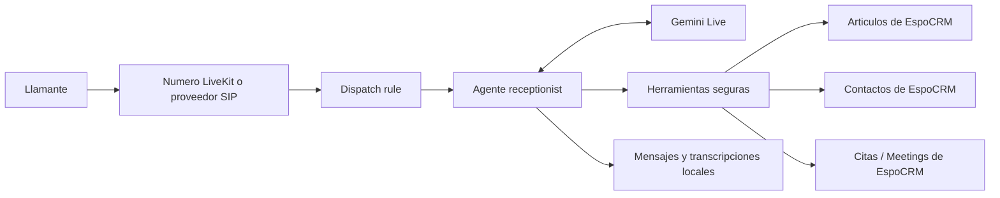

# Recepcionista IA con LiveKit, Gemini y EspoCRM

Esta edicion extiende AI Receptionist para convertirlo en una recepcionista
telefonica conectada a un CRM real. Atiende llamadas en tiempo real, responde
preguntas desde la base de conocimiento de EspoCRM y administra el ciclo
completo de las citas: crear, consultar, reprogramar y cancelar.

La configuracion de demostracion representa una clinica dental ficticia en
espanol. No contiene claves, telefonos privados ni datos de pacientes reales.

## Que incluye esta edicion

- Voz conversacional directa con **Google Gemini Live**.
- Compatibilidad conservada con **OpenAI Realtime**.
- Numero telefonico nativo de **LiveKit Cloud** para demos entrantes.
- Integracion REST con **EspoCRM**.
- Base de conocimiento administrable desde el CRM.
- Contactos y citas relacionados dentro del CRM.
- Agendamiento, consulta, reprogramacion y cancelacion durante la llamada.
- Verificacion de identidad mediante nombre completo y telefono.
- Confirmacion explicita antes de modificar o cancelar una cita.
- EspoCRM y MariaDB reproducibles mediante Docker Compose.
- Dataset ficticio e idempotente para pruebas.
- Aprovisionador opcional para Netelip y LiveKit SIP.
- Configuracion multiempresa mediante metadatos de dispatch.
- Pruebas automatizadas para voz, CRM, citas y telefonia.

## Arquitectura



LiveKit recibe la llamada y crea una sala privada. La regla de dispatch inicia
el worker llamado `receptionist` y entrega este metadato:

```json
{
  "agentName": "receptionist",
  "metadata": "{\"config\":\"example-dental\"}"
}
```

El metadato selecciona
`config/businesses/example-dental.yaml`. Las credenciales nunca forman parte
de la regla: se leen desde el archivo local `.env`.

## Integracion con EspoCRM

La implementacion se encuentra en
`receptionist/crm/espocrm.py`. Utiliza la API REST de EspoCRM y solo expone al
modelo las operaciones necesarias para la recepcion.

| Necesidad | Entidad EspoCRM |
|---|---|
| Empresa o clinica | `Account` |
| Paciente o cliente | `Contact` |
| Cita | `Meeting` |
| Horarios, seguros y ubicacion | `KnowledgeBaseArticle` |

### Preguntas frecuentes

La herramienta `lookup_faq` busca articulos publicados en EspoCRM. Esto
permite cambiar horarios, seguros, ubicacion y politicas desde el CRM sin
editar el prompt ni volver a desplegar el agente.

### Crear una cita

El flujo:

1. Solicita nombre completo y telefono de retorno.
2. Busca el contacto o crea uno nuevo de forma controlada.
3. Consulta conflictos antes de prometer disponibilidad.
4. Requiere confirmacion del horario.
5. Crea un `Meeting` relacionado con el contacto y la cuenta.

### Consultar, reprogramar y cancelar

Para consultar citas existentes deben coincidir nombre completo y telefono.
El modelo recibe el ID real del CRM y no puede inventarlo. La reprogramacion
valida nuevamente el horario y la cancelacion exige confirmacion explicita.
Los errores del CRM se transforman en respuestas seguras: el agente ofrece
tomar un mensaje en lugar de afirmar que una operacion fue completada.

## Ventajas frente a Tel Assistant base

Esta comparacion se refiere a la instalacion base anterior a esta extension.
Las funciones originales permanecen disponibles.

| Capacidad | Tel Assistant base | Esta edicion |
|---|---|---|
| Motor de voz predeterminado | OpenAI Realtime | Gemini Live, manteniendo OpenAI |
| Idioma de la demo | Principalmente ingles | Clinica demo en espanol |
| Preguntas frecuentes | YAML estatico | Articulos publicados en EspoCRM |
| Persistencia de clientes | Sin CRM obligatorio | Accounts y Contacts |
| Crear citas | Calendario opcional | Meetings relacionados con contactos |
| Consultar citas | Flujo limitado al calendario | Busqueda segura por identidad en CRM |
| Reprogramar y cancelar | No era el foco del flujo base | Herramientas dedicadas con confirmacion |
| Datos demo | Configuracion manual | Seed idempotente con datos ficticios |
| CRM local | Instalacion separada | Docker Compose incluido |
| Telefonia para demo | SIP externo | Numero nativo LiveKit o SIP externo |
| Netelip | Configuracion manual | Plan y aprovisionador incluidos |
| Fuente de verdad | Archivos de configuracion | Configuracion + CRM operativo |

Las ventajas principales son:

- **Informacion actualizable:** recepcion puede editar articulos en EspoCRM sin
  cambiar codigo.
- **Continuidad operativa:** contactos, citas y estados sobreviven a cada
  llamada.
- **Menos alucinaciones:** disponibilidad, IDs y resultados vienen del CRM.
- **Trazabilidad:** una cita queda relacionada con el paciente y la cuenta.
- **Demo reproducible:** CRM, base de datos y datos ficticios se levantan con
  comandos documentados.
- **Flexibilidad:** se puede usar Gemini u OpenAI y telefonia nativa de LiveKit
  o un proveedor SIP.
- **Autohospedaje:** no existe una tarifa SaaS propia de esta integracion; se
  pagan solamente los servicios externos que se elijan.

## Instalacion rapida en Windows

### Requisitos

- Python 3.11 o superior.
- Docker Desktop.
- Una cuenta de LiveKit Cloud.
- Una clave de Google Gemini.
- PowerShell.

### 1. Preparar Python

```powershell
git clone https://github.com/configurowebmax/AIReceptionist.git
cd AIReceptionist
python -m venv .venv
.\.venv\Scripts\Activate.ps1
python -m pip install -e ".[dev]"
```

### 2. Crear archivos privados

```powershell
Copy-Item .env.example .env
Copy-Item infra\espocrm\.env.example infra\espocrm\.env
```

Edita ambos archivos localmente. No los publiques.

```dotenv
LIVEKIT_URL=wss://your-project.livekit.cloud
LIVEKIT_API_KEY=your-livekit-api-key
LIVEKIT_API_SECRET=your-livekit-api-secret
RECEPTIONIST_AGENT_NAME=receptionist
GOOGLE_API_KEY=your-google-api-key
ESPOCRM_USERNAME=admin
ESPOCRM_PASSWORD=your-local-espocrm-password
```

El usuario y la contrasena del CRM raiz deben coincidir con
`ESPOCRM_ADMIN_USERNAME` y `ESPOCRM_ADMIN_PASSWORD` en
`infra/espocrm/.env`.

### 3. Iniciar EspoCRM

```powershell
docker compose --env-file infra\espocrm\.env -f infra\espocrm\compose.yaml up -d
```

Abre <http://localhost:8080> y espera a que el contenedor aparezca como
`healthy`.

### 4. Cargar informacion demo

```powershell
.\.venv\Scripts\python.exe infra\espocrm\seed_demo.py
```

El seed crea una cuenta, seis pacientes ficticios, citas en varios estados y
siete articulos sobre horarios, seguros, ubicacion y politicas. Se puede
ejecutar varias veces sin duplicar registros.

### 5. Configurar LiveKit

La ruta mas simple para una demo entrante es:

1. Rentar un numero local de Estados Unidos en **Telephony -> Phone Numbers**.
2. Crear una dispatch rule individual.
3. Establecer `agentName: receptionist`.
4. Agregar el metadato `{"config":"example-dental"}`.
5. En el numero, elegir **Configure with existing dispatch rules**.

La guia detallada esta en
`documentation/livekit-native-phone-setup.md`.

### 6. Ejecutar el agente

```powershell
.\.venv\Scripts\python.exe -m receptionist.agent dev
```

Espera el mensaje `registered worker` y llama al numero configurado.

## Escenarios de prueba

### Base de conocimiento

- "¿Cual es el horario de atencion?"
- "¿Donde estan ubicados?"
- "¿Que seguros aceptan?"

### Citas

- "Quiero agendar una valoracion."
- "Busca las citas de Ana Torres con el telefono +12025550101."
- "Quiero cambiar mi cita."
- "Confirmo que deseo cancelar la cita."

Los nombres, telefonos `+1 202-555-01xx`, dominios `example.test` y
direcciones de la demo son ficticios.

## Seguridad y privacidad

El repositorio ignora:

- `.env` y `.env.local`;
- `infra/espocrm/.env`;
- `secrets/`;
- `.tools/`;
- `breadcrumbs/`;
- `messages/`, `transcripts/` y `recordings/`.

Para produccion:

- usa HTTPS entre el agente y EspoCRM;
- crea un API User con permisos minimos sobre Account, Contact, Meeting y
  KnowledgeBaseArticle;
- utiliza `ESPOCRM_API_KEY` en vez de la cuenta administradora;
- restringe y rota las claves de Gemini y LiveKit;
- define retencion para grabaciones y transcripciones;
- no cargues pacientes reales en el dataset demo;
- protege copias de seguridad de MariaDB y EspoCRM.

## Despliegue

Para la demo local, LiveKit esta en la nube y el worker y EspoCRM se ejecutan
en el computador. Ese computador debe permanecer encendido mientras recibe
llamadas.

Si despliegas el agente en LiveKit Cloud, Railway, Fly.io o un VPS, no puede
acceder al EspoCRM local mediante `http://localhost:8080`. Debes alojar
EspoCRM en una direccion HTTPS accesible para el worker y actualizar
`crm.base_url`.

## Limitaciones

- Los numeros nativos de LiveKit deben verificarse contra la disponibilidad y
  condiciones vigentes de LiveKit.
- El flujo nativo utilizado para la demo es de llamadas entrantes.
- Las transferencias y llamadas salientes pueden requerir un proveedor SIP.
- El asistente no diagnostica ni prescribe tratamientos.
- Docker Compose local no sustituye una estrategia de produccion, respaldo y
  monitoreo.

## Calidad

La integracion incluye pruebas de:

- cliente REST de EspoCRM;
- configuracion y autenticacion del CRM;
- busqueda de conocimiento;
- creacion, consulta, reprogramacion y cancelacion;
- verificacion de identidad;
- proveedor Gemini;
- aprovisionamiento Netelip;
- ciclo de vida y metadatos de llamadas.

Estado validado al publicar esta edicion: **715 pruebas aprobadas y 2
omitidas**.

## Documentacion relacionada

- [Guia de numero nativo LiveKit](documentation/livekit-native-phone-setup.md)
- [EspoCRM local y datos demo](infra/espocrm/README.md)
- [Netelip + LiveKit](documentation/netelip-livekit-setup.md)
- [Referencia de configuracion](documentation/configuration-reference.md)
- [Referencia de herramientas](documentation/function-tools-reference.md)
- [Arquitectura](documentation/architecture.md)

## Licencia

El proyecto mantiene la licencia AGPL-3.0 del repositorio original. Si
modificas el software y lo ofreces como servicio de red, revisa las
obligaciones de esa licencia y publica el codigo fuente correspondiente.
